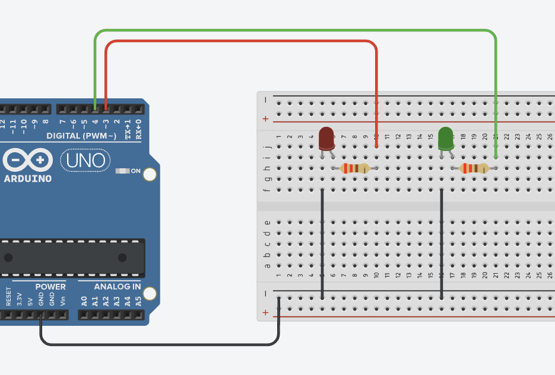

# Arduino & Friends: Serial Communications(Week 4)

## Exercise 1

1-Make a simple circuit with two LEDs – red and green, connected to digital pins 3 and 4, respectively.

2-Write a program allows you to select them:

-When you enter a “R” via serial monitor, the red LED must switch on. If you enter the 	same character another time, it must switch off.

-When you enter a “G” via serial monitor, the green LED must switch on. If you enter the same character another time, it must switch off.

1. Connecting a pushbutton to the Arduino (pull-up, see [Week4 Exercise 1 (https://github.com/tjcruz-dei/TI-MDM-2023_24/tree/main/PL4-Serial-communications/Exercises/Exercise1/Exercise1.ino))
